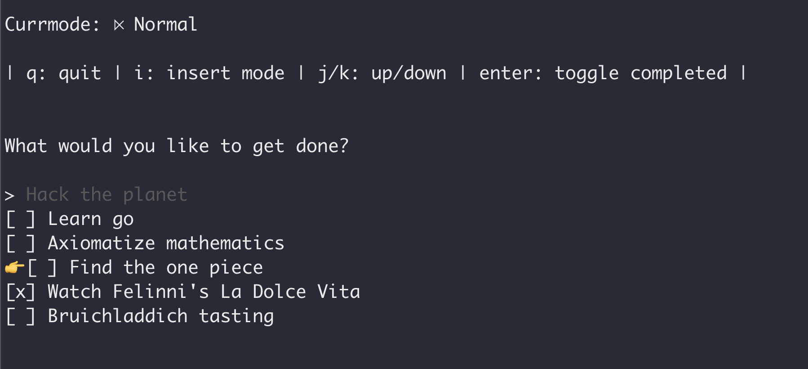

# Laihfe
Something to inspire myself to get more organized and learn go.
For now, todo manager. In the future, useful!


## Usage
Currently only clone and run. In the future, a package!
```
git clone https://github.com/sinakhalili/laihfe
cd laihfe
go run main.go
```

## How it works
Todos are read and stored in a plain text file `.todos.txt`. 
Type `i` to go into insert mode and write a todo. `esc` will put you
into normal mode where you can toggle todos on and off.

## Keep it top of mind
Add the `laihfe -l` command at the end of your `bashrc`/`zshrc` to
spit out your current todos. That way you can see them every time
you open a terminal!

Uses the wonderful [bubbletea](https://github.com/charmbracelet/bubbletea) package for the TUI. 
